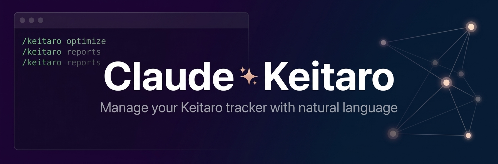

<p align="center">
  
</p>

# Claude Keitaro — Keitaro Tracker Management for Claude Code

Manage your Keitaro tracker with natural language. Create campaigns, optimize flows, generate landings, analyze performance — all through Claude Code. Built for affiliate marketers and media buyers.

[](https://claude.ai/claude-code)
[](LICENSE)

## What It Does

Talk to your Keitaro tracker like a human:

```
You: create campaign for gambling, GEO Germany, 3 landings
Claude: Created campaign "gambling_de_20260327" with 3 flows...

You: what's losing money?
Claude: Campaign #21 "dating_us" — ROI -56%, burning $45/day. Kill it?

You: optimize all campaigns
Claude: Found 5 flows to kill (saving $85/day), 3 to scale (+$45/day). Apply?
```

## Installation

### One-Command Install (macOS/Linux)

```bash
curl -fsSL https://raw.githubusercontent.com/iso73-ops/claude-keitaro/main/install.sh | bash
```

### One-Command Install (Windows PowerShell)

```powershell
irm https://raw.githubusercontent.com/iso73-ops/claude-keitaro/main/install.ps1 | iex
```

### Manual Install

```bash
git clone https://github.com/iso73-ops/claude-keitaro.git
cd claude-keitaro
./install.sh
```

## Setup

1. Set environment variables:

```bash
export KEITARO_URL="https://your-tracker.com"
export KEITARO_API_KEY="your-api-key"
```

2. Start Claude Code and verify:

```bash
claude
/keitaro setup
```

## Commands

| Command | Description |
|---------|-------------|
| `/keitaro setup` | Connect to Keitaro API, verify access |
| `/keitaro campaigns` | Create, list, update, disable, clone campaigns |
| `/keitaro flows` | Manage flows, weights, filters, A/B tests, cloaking |
| `/keitaro reports` | Analytics by campaign, flow, GEO, device, time |
| `/keitaro optimize` | Auto-optimize: kill losers, scale winners |
| `/keitaro landing` | Generate landing/prelanding content for any vertical |
| `/keitaro audit` | Health check: dead flows, broken postbacks, misconfig |

## Supported Verticals

All verticals with built-in benchmarks:

- Gambling / Casino / Betting
- Crypto / Trading / Forex
- Nutra / Health & Beauty
- Dating / Adult
- Finance / Loans / Insurance
- Sweepstakes / Leadgen
- E-commerce / Dropshipping
- Medical / Health Clinics
- Software / Apps / Utilities

## Features

### Direct API Integration
Unlike tools that work with exports and screenshots, Claude Keitaro connects **directly to your tracker** via the Admin API. Say it in text — Keitaro executes.

### 35 Audit Checks
Campaign health, flow structure, postback tracking, domain status, and landing health with weighted scoring.

### Smart Optimization
Kill/scale rules based on vertical-specific benchmarks. Minimum sample sizes prevent premature decisions.

### Flow Pattern Library
Pre-built patterns for cloaking, A/B testing, GEO splits, device splits, offer rotation, and time-based routing.

### Landing Generator
Generate prelanding and landing page content for any vertical in any language, directly from Claude.

## Architecture

```
~/.claude/skills/keitaro/              # Main orchestrator
~/.claude/skills/keitaro/references/   # 5 reference files (API, verticals, rules)
~/.claude/skills/keitaro/scripts/      # Python API helper
~/.claude/skills/keitaro-*/            # 7 sub-skills
~/.claude/agents/campaign-*.md         # 3 subagents
~/.claude/agents/flow-*.md
~/.claude/agents/landing-*.md
```

### How It Works

1. **Orchestrator** (`/keitaro`) routes commands to specialized sub-skills
2. **Sub-skills** handle specific domains (campaigns, flows, reports, etc.)
3. **Agents** run in parallel for audits and bulk analysis
4. **References** load on-demand — vertical benchmarks, API specs, optimization rules
5. **API helper** (`keitaro_api.py`) handles all Keitaro API communication

## Requirements

- Claude Code CLI
- Python 3.10+ with `requests` package
- Keitaro tracker with Admin API access

## Security

- API keys are never displayed in full (masked: `abcd...wxyz`)
- Keys are read from environment variables, never stored in files
- All destructive operations require explicit confirmation

## Uninstall

```bash
curl -fsSL https://raw.githubusercontent.com/iso73-ops/claude-keitaro/main/uninstall.sh | bash
```

## License

MIT License - see [LICENSE](LICENSE) for details.

---

Built for Claude Code by [@iso73-ops](https://github.com/iso73-ops)
